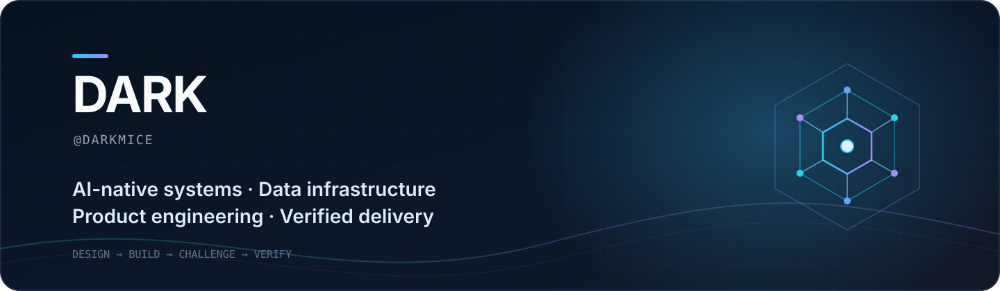

<p align="center">
  
</p>

<p align="center">
  <a href="https://github.com/darkmice/darkmice/blob/main/README.md">English</a>
  ·
  <strong>简体中文</strong>
</p>

<p align="center">
  <strong>把 AI 能力做成可运行、可交付、可验证的系统。</strong><br />
  <sub>我关注的不只是模型能力，更是它如何进入真实产品并稳定完成工作。</sub>
</p>

<p align="center">
  <a href="https://github.com/darkmice?tab=repositories">项目</a>
  ·
  <a href="https://github.com/talon-org">Talon 组织</a>
  ·
  <a href="https://formilyjs.org/">Formily</a>
</p>

---

### 我在构建什么

| | 方向 | 落到实际系统里 |
|---|---|---|
| **01** | **AI 执行系统** | Agent 编排、本地执行、工具协议、沙箱，以及有人参与决策和验收的交付闭环。 |
| **02** | **AI 原生数据基础设施** | 将 SQL、KV、时序、消息队列、向量、全文检索、GEO、图与 AI 能力整合进统一运行时。 |
| **03** | **开发者产品** | 从产品定义和交互设计，到 SDK、组件系统、桌面客户端、文档、打包与发布流程。 |
| **04** | **质量系统** | 以证据为基础的工程方法：对抗审查、明确风险边界、失败路径测试和可核验验收。 |

### 代表项目

| 项目 | 核心方向 | 它说明了什么 |
|---|---|---|
| [**Formily**](https://github.com/alibaba/formily) | 面向 React、React Native、Vue 2 和 Vue 3 的跨端高性能表单方案 | 参与具有广泛使用基础的开源表单生态建设 |
| [**Talon Pilot Studio**](https://github.com/darkmice/talon-pilot-studio) | 跨平台 AI 数字员工指挥台 | 将任务拆解、Agent 执行、产物预览和验收组织成一个产品流程 |
| [**Talon**](https://github.com/darkmice/talon-bin) | 单二进制、零外部依赖的多模型数据引擎 | SQL · KV · 时序 · MQ · 向量 · 全文检索 · GEO · 图 · AI |
| [**Talon MCP**](https://github.com/darkmice/talon-mcp) | Talon 的 Model Context Protocol 服务 | 让兼容 MCP 的 Agent 直接使用九类数据引擎 |
| [**Talon Doc Runtime**](https://github.com/darkmice/talon-doc-runtime) | 面向 Agent 的结构化文档运行时 | 30+ 语义组件，用紧凑 DSL 生成带主题和交互能力的交付文档 |
| [**Talon UI**](https://github.com/darkmice/talon-ui) | 设计令牌与 React 组件库 | 一套包含 45 个组件、以 Ant Design 能力对齐为目标的产品系统 |
| [**Dark Tribunal**](https://github.com/darkmice/dark-team-review) | 面向编码 Agent 的风险分级对抗审查 | 用真实证据连接实现、反向审查、QA 与体验验收 |

### 我的工作方法

```text
产品目标
    ↓
系统边界  →  协议与数据模型  →  实现
    ↓                         ↓
风险账本  ←  对抗审查        ←  证据
    ↓
可验证交付
```

- **产品目标先于技术管线**——先明确系统必须改善的决策或工作流程。
- **建立唯一事实源**——把协议、状态归属和责任边界写清楚。
- **在重要处坚持本地优先**——尽可能让执行过程和数据留在用户控制之下。
- **证据胜过乐观判断**——测试变绿或代码推送成功，不等于结果已经通过验收。

### 用来完成交付的技术栈

<p>
  
  
  
  
  
  
  
</p>

<p align="center">
  <sub>持续构建 AI Agent、数据系统、产品工程与交付质量的交叉能力。</sub>
</p>
